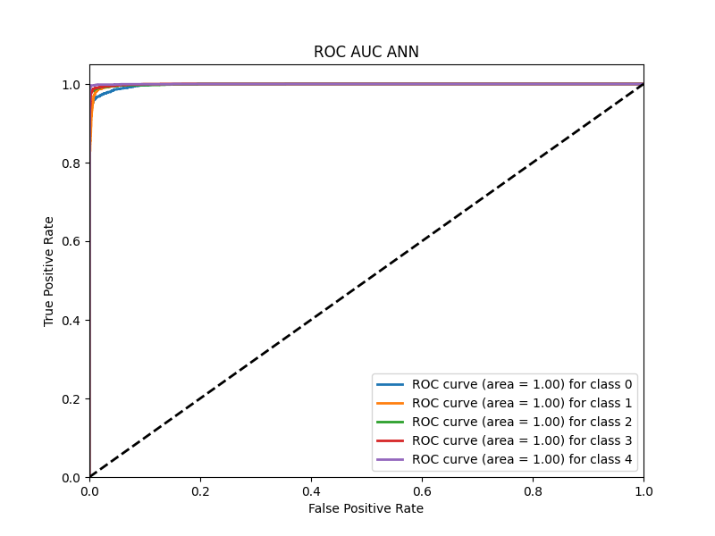

# Recent Model

I have been working on to predict 1/5 regions an Ultrasonic Anomaly is located in given magnitude values for each frequency bin of the FFT of the signal from microphone array

## Model Architecture

Model: "sequential"

| Layer | Output Shape | Param # |
|-------|--------------|---------|
| dense (Dense) | (None, 762) | 581406 |
| dense_1 (Dense) | (None, 256) | 195328 |
| dropout (Dropout) | (None, 256) | 0 |
| dense_2 (Dense) | (None, 128) | 32896 |
| dense_3 (Dense) | (None, 5) | 645 |

Total params: 810275 (3.09 MB)

Trainable params: 810275 (3.09 MB)

Non-trainable params: 0 (0.00 Byte)

## Dataset visualization

## Model Results

### Metrics

test Accuracy: 97.42%

train Accuracy: 99.12%

              precision    recall  f1-score   support

           1       0.97      0.95      0.96      1949
           2       0.97      0.95      0.96      1861
           3       0.98      0.98      0.98      1918
           4       0.96      0.99      0.98      1955
           5       0.98      1.00      0.99      1917
    accuracy                           0.97      9600

### Confusion Matrix

### ROC Curve

## Accuracy/Loss Plots

